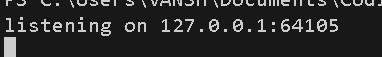
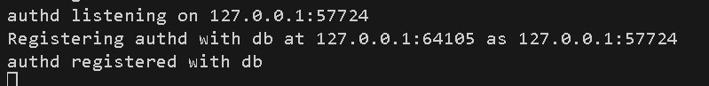
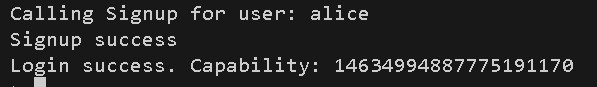
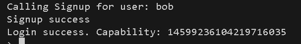
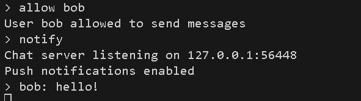
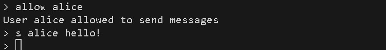

# Real-Time Messaging Service

A **distributed, real-time chat application** built in Go using a custom RPC framework over UDP.  
The system supports **user authentication**, **permission controls**, and **dual-mode message delivery**:  
- **Pull-based messaging** (clients poll for new messages manually)  
- **Push-based messaging** (server initiates callbacks to clients using remote object proxies)

The backend is organized into **independent microservices**:
- **Database Service (`dbd`)** – simple key-value store for service discovery
- **Authentication Service (`authd`)** – user signup/login, issues capabilities
- **Message Service (`messaged`)** – manages user inboxes, sends/receives messages, and pushes notifications
- **Chat Client (`chat`)** – command-line interface for users

---

## Features
- User signup and login with capability-based authentication
- Grant/block permissions for sending messages
- Pull messaging via `read` command
- Push messaging via `notify` command (server-initiated notifications)
- Service discovery through database registration

---


## How to Run

Each service runs as a separate Go process. **All processes pick a random port**, which gets registered with the database server for discovery. 

**The db server, auth server, message server, and every single chat client must be ran on separate terminals**.

### 1. Start the Database Server

```bash
go run cmd/dbd/dbd.go
```

- Outputs the database server's listening address (random port).  
- Example:



---

### 2. Start the Authentication Server

```bash
go run cmd/authd/authd.go <db_address>
```


- `<db_address>` = address printed by the dbd, i.e., the command above in Step 1.  
- So the command for the authentication server in this case would be `go run cmd/authd/authd.go 127.0.0.1:64105`
- The following is the output of the command we just entered:




---

### 3. Start the Message Server

```bash
go run cmd/messaged/messaged.go <db_address>
```

- Repeat the same process for the message server.  
- The following is the output:


---

### 4. Start Chat Clients
Open **two terminals** (for User A and User B). Each runs:

```bash
go run cmd/chat/chat.go <db_address> s <username> <password>
```


- `s` → signup and login (use `l` for login if already signed up).  
- Commands in this case (the db address is the same as in prior steps):

```
go run cmd/chat/chat.go 127.0.0.1:64105 s alice pswd
go run cmd/chat/chat.go 127.0.0.1:64105 s bob pswd
```
- Resultant output



---
### 5. Send and Receive Messages

- These are the commands available after logging in.


```
s <user> <message> # Send message
read # Read all queued messages (pull mode)
notify # Enable push notifications (server will call back automatically)
allow <user> # Allow a user to send messages to you
block <user> # Block a user from sending messages
```


#### Example Session for Push Functionality
1. Alice allows Bob:

`allow bob` (in Alice's terminal)


2. Bob allows Alice:

`allow alice` (in Bob's terminal)


3. Alice enables push notifications:

`notify` (in Alice's terminal)


4. Bob sends Alice a message:

`s alice Hello!` (in Bob's terminal)


5. Alice immediately sees the pushed notification:

`bob: Hello!` (will show up in Alice's terminal)





---

A similar approach can be followed for pull functionality. In that case, skip the `notify` command in Alice's terminal and once Bob has sent the message, enter the `read` command in Alice's terminal.

